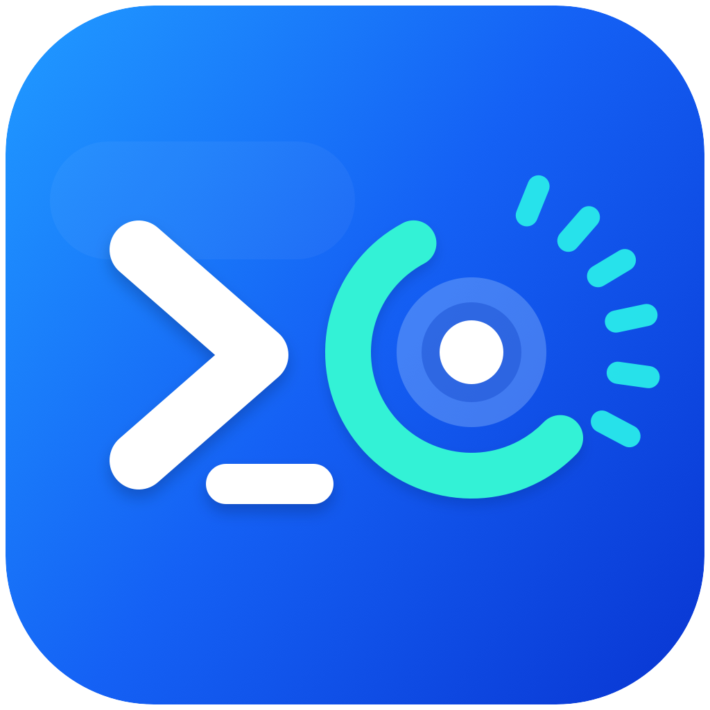
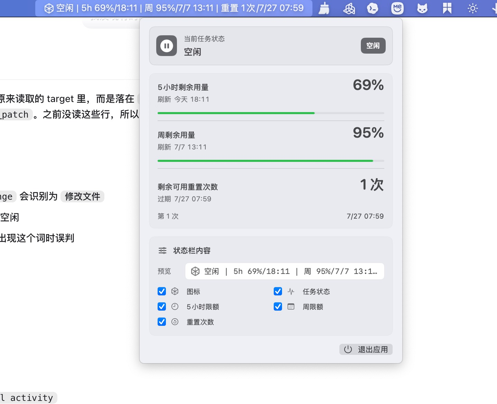

# Codex Status Bar

一个 macOS 状态栏小工具，用来实时查看 Codex 的任务状态、5 小时用量、周用量以及可用重置次数。

> 非官方项目。它依赖本机 Codex 客户端的本地日志、认证文件和当前内部接口；如果 Codex 客户端后续调整实现，相关解析逻辑可能需要同步更新。

<p align="center">
  
</p>

<p align="center">
  
</p>

## 功能

- 在 macOS 状态栏直接显示关键信息，无需点开展开面板：
  - 当前任务状态
  - 5 小时剩余用量和刷新时间
  - 周剩余用量和刷新时间
  - 剩余可用重置次数和最早过期时间
- 每 5 秒刷新一次额度信息。
- 每 1 秒刷新一次任务状态。
- 当 Codex 处于需要用户确认、审批或等待输入的状态时，状态栏会闪烁提醒。
- 点击状态栏可查看更完整的详情面板，包括每一次可用重置次数的过期时间。
- 展开面板中可以配置状态栏展示内容，包括图标、任务状态、5 小时限额、周限额和重置次数。
- 展开面板中可以直接退出应用。
- 菜单栏常驻运行，不显示 Dock 图标。

## 截图

状态栏文本示例：

```text
运行中:思考中 | 5h 72%/19:52 | 周 84%/7/6 09:51 | 重置 2次/7/27 07:59
```

展开面板会显示：

- 当前任务状态
- 5 小时剩余用量
- 周剩余用量
- 剩余可用重置次数
- 每一次可用重置的过期时间

## 系统要求

- macOS 14 或更高版本
- Xcode Command Line Tools
- Swift 5.9 或更高版本
- 已安装并登录 Codex 桌面客户端

安装 Xcode Command Line Tools：

```bash
xcode-select --install
```

## 安装和运行

克隆仓库：

```bash
git clone git@github.com:andeyibiao/codex-status-bar.git
cd codex-status-bar
```

构建并运行：

```bash
script/build_and_run.sh
```

验证应用是否成功启动：

```bash
script/build_and_run.sh --verify
```

脚本会生成并启动：

```text
dist/CodexStatusBar.app
```

如果你想长期使用，可以把构建后的 app 拷贝到 `/Applications`：

```bash
cp -R dist/CodexStatusBar.app /Applications/
```

## 数据来源

这个工具的目标是尽量贴近 Codex 客户端自己看到的数据，因此优先复用 Codex 本机已有的数据通道，而不是维护一套独立估算逻辑。

### 额度信息

5 小时用量、周用量和对应刷新时间来自 Codex app-server 的 `account/rateLimits/read` 方法。

应用启动时会拉起本机 Codex app-server：

```text
/Applications/Codex.app/Contents/Resources/codex app-server --stdio
```

如果上面的路径不存在，会回退到：

```text
codex app-server --stdio
```

随后通过 JSON-RPC 调用 `account/rateLimits/read`。当前读取的主要字段包括：

- `rateLimitsByLimitId.codex.primary.usedPercent`：5 小时窗口已使用百分比
- `rateLimitsByLimitId.codex.primary.resetsAt`：5 小时窗口刷新时间
- `rateLimitsByLimitId.codex.secondary.usedPercent`：周窗口已使用百分比
- `rateLimitsByLimitId.codex.secondary.resetsAt`：周窗口刷新时间
- `rateLimitResetCredits.availableCount`：可用重置次数的汇总值，如果接口返回该字段

状态栏展示的是剩余百分比，计算方式为：

```text
剩余百分比 = 100 - usedPercent
```

额度信息每 5 秒刷新一次。刷新失败时不会弹窗、不会自动重试轰炸接口，也不会清空上一次成功读取的数据。

### 可用重置次数

可用重置次数明细来自 ChatGPT 后端的 reset credits 接口：

```text
https://chatgpt.com/backend-api/wham/rate-limit-reset-credits
```

请求时会读取本机 Codex 登录文件：

```text
~/.codex/auth.json
```

使用其中的：

- `tokens.access_token`：作为 `Authorization: Bearer ...`
- `tokens.account_id`：作为 `chatgpt-account-id` 请求头

返回数据里，应用会筛选 `status` 为空或 `available` 的 credits，并读取每一项的 `expires_at`。展开面板会逐条展示每一次可用重置的过期时间；状态栏上展示的是：

- 可用重置总次数
- 最早过期的那一次重置时间

如果 reset credits 明细请求失败，应用会保留额度窗口数据，但重置明细会显示为不可用或空列表。

### 当前任务状态

任务状态来自本机 Codex 日志数据库：

```text
~/.codex/logs_2.sqlite
```

应用每 1 秒读取最近一段时间的日志，主要关注这些日志目标：

- `codex_app_server::outgoing_message`
- `codex_core::session::turn`
- `codex_core::stream_events_utils`
- `codex_api::sse::responses`
- `codex_api::endpoint::responses_websocket`
- `codex_otel.trace_safe`
- `codex_otel.log_only`

状态推断会结合 turn 日志、app-server 事件和 SSE 流式事件。常见识别信号包括：

- `turn/started`
- `turn/completed`
- `item/started`
- `item/completed`
- `item/agentMessage/delta`
- `response.output_text.delta`
- `response.function_call_arguments.delta`
- `requestApproval`
- `has_pending_input=true`
- `apply_patch`
- `commandExecution`
- `exec_command`

目前会归类为这些状态：

- `空闲`
- `运行中`
- `思考中`
- `执行命令`
- `调用工具`
- `修改文件`
- `输出中`
- `等待确认`
- `已完成`
- `失败`

其中 `等待确认` 会触发状态栏闪烁，用来提醒需要用户审批、确认或继续输入。任务状态属于日志推断结果，准确性依赖 Codex 客户端当前日志格式；如果 Codex 后续调整日志事件名，可能需要同步更新这里的解析逻辑。

## 隐私说明

- 应用不采集、不上传你的项目代码。
- 应用会读取本机 Codex 日志数据库 `~/.codex/logs_2.sqlite` 来推断任务状态。
- 应用会读取本机 `~/.codex/auth.json` 中的 Codex 登录信息，用于请求 reset credits 明细。
- 除了请求 ChatGPT/OpenAI 相关接口获取额度和重置次数外，应用没有自己的第三方后端。

请只在你信任的本机环境中运行。

## 项目结构

```text
.
├── Package.swift
├── Resources/
│   ├── AppIcon.icns
│   └── AppIcon.png
├── Sources/CodexStatusBar/
│   ├── App/
│   ├── Models/
│   ├── Services/
│   ├── Stores/
│   ├── Support/
│   └── Views/
└── script/
    └── build_and_run.sh
```

## 开发

构建：

```bash
swift build
```

运行：

```bash
script/build_and_run.sh
```

查看日志：

```bash
script/build_and_run.sh --logs
```

调试：

```bash
script/build_and_run.sh --debug
```

## 已知限制

- 这是一个非官方工具，不使用公开稳定 API。
- Codex 客户端的日志格式、app-server 方法或认证文件结构变化后，可能需要更新解析逻辑。
- 首次运行时，如果 macOS 阻止打开未签名应用，需要在系统设置中允许打开，或从源码本地构建运行。
- 当前没有偏好设置界面，刷新间隔和展示字段写在代码里。

## License

MIT License. See [LICENSE](LICENSE).
